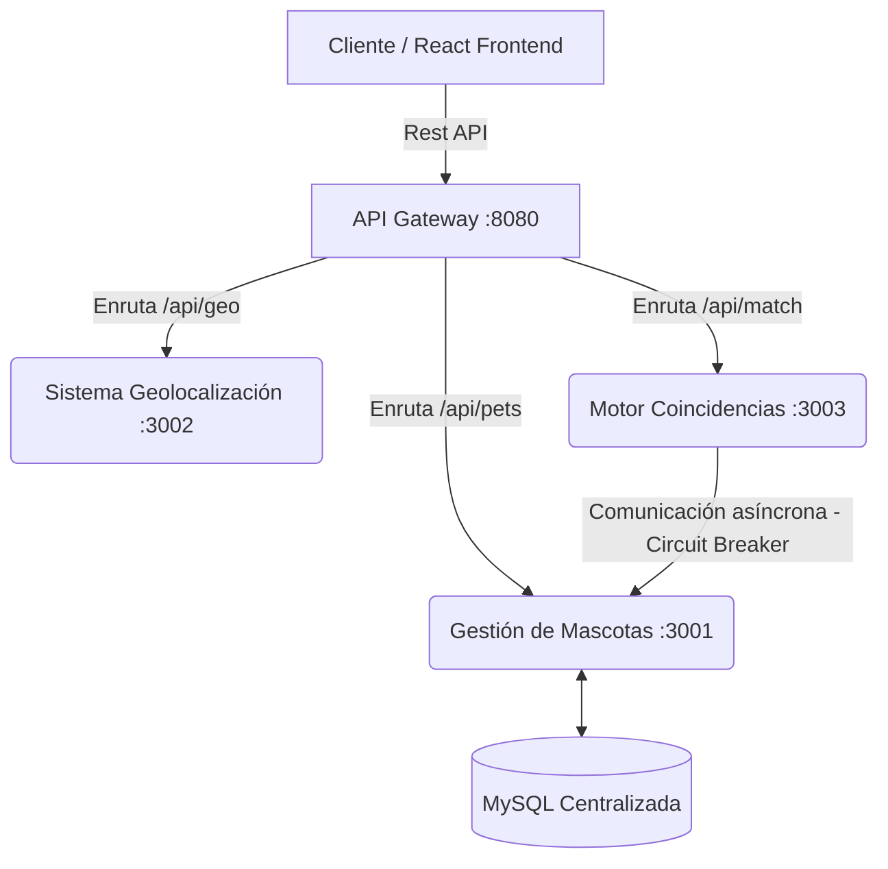

# Informe de Arquitectura y Patrones: Sanos y Salvos (Parcial 1)

## 1. Propuesta de Arquitectura

El ecosistema "Sanos y Salvos" se ha construido bajo un modelo de **Microservicios (Microservices Architecture)**. Este arquetipo arquitectónico fue elegido porque la plataforma gestionará una alta carga de reportes dispersos desde varias entidades (dueños de mascotas, clínicas, refugios) garantizando que si un módulo central colapsa, los demás puedan seguir operando. La arquitectura está orquestada de formato contenerizado empleando Docker, garantizando portabilidad e independencia de lenguaje y sistema operativo.

### Diagrama de la Arquitectura de Microservicios

## 2. Microservicios Clave (Separación de Responsabilidades)

El sistema se separó limpiamente en los siguientes componentes:

1. **API Gateway:** Único punto de entrada que distribuye la información. Evita que el cliente tenga que conocer la red interna y lidiar con la seguridad individual de los microservicios.
2. **Sistema de Gestión de Mascotas (Pet Service):** Microservicio altamente transaccional. Es la única fuente de la verdad para inyectar o consultar mascotas extraviadas/encontradas.
3. **Sistema de Geolocalización (Geo Service):** Microservicio ligero desacoplado preparado para el renderizado geo-espacial y zonas de riesgo.
4. **Motor de Coincidencias (Match Service):** Microservicio inteligente centrado en procesamiento de listas. No asume propiedad de los datos; los consulta de "Pet Service" y corre los algoritmos de predicción mediante atributos.

## 3. Justificación de los Patrones de Diseño Implementados

Se han implementado y justificado los siguientes estándares de la industria obligatorios para esta etapa:

### A. Repository Pattern
* **Ubicación:** `Pet Service` (`PetReportRepository.java`)
* **Justificación:** Spring Data JPA abstrae la interacción nativa a MySQL (SQL queries) detrás de una interfaz. Esto facilita la persistencia de datos (guardar Mascotas), oculta la lógica detrás de conectores de BD en una sola capa limpia y permite que en el futuro, si Sanos y Salvos reemplaza MySQL por PostgreSQL, el Controlador de la aplicación o la capa de negocio no deba ser re-escrita, reduciendo el acoplamiento drásticamente.

### B. Factory Method Pattern
* **Ubicación:** `Pet Service` (`PetReportFactory.java`)
* **Justificación:** La creación de reportes puede volverse extensa. Hay diferencias conceptuales menores entre un reporte creado por una Institución o un Usuario Normal ("LOST" vs "FOUND"). El patrón delegó la responsabilidad a una Fábrica que centraliza y valida las reglas del objeto antes de instanciarlo. Esto fomenta el principio **Open/Closed** de SOLID; si después agregamos "Reportes de Avistamientos", solo creamos la lógica en la factoría y no tocamos los Controladores.

### C. Circuit Breaker Pattern
* **Ubicación:** `Match Service` (`PetServiceConsumer.java` vía *Resilience4j*)
* **Justificación:** Puesto que el Motor de Matches obtiene la información mandando una petición HTTP al *Pet Service*, existe un alto riesgo latente: Si MySQL cae o el Pet Service pierde la red, el Match Service se quedaría esperando hasta saturarse y colapsaría. El *Circuit Breaker* envuelve esa llamada; si ocurre una falla sostenida, abre el circuito e intercepta las futuras llamadas para proteger el servidor y retornar una ruta segura de "Fallo Controlado - Intente de nuevo más tarde", previniendo fracasos en cascada entre microservicios.
